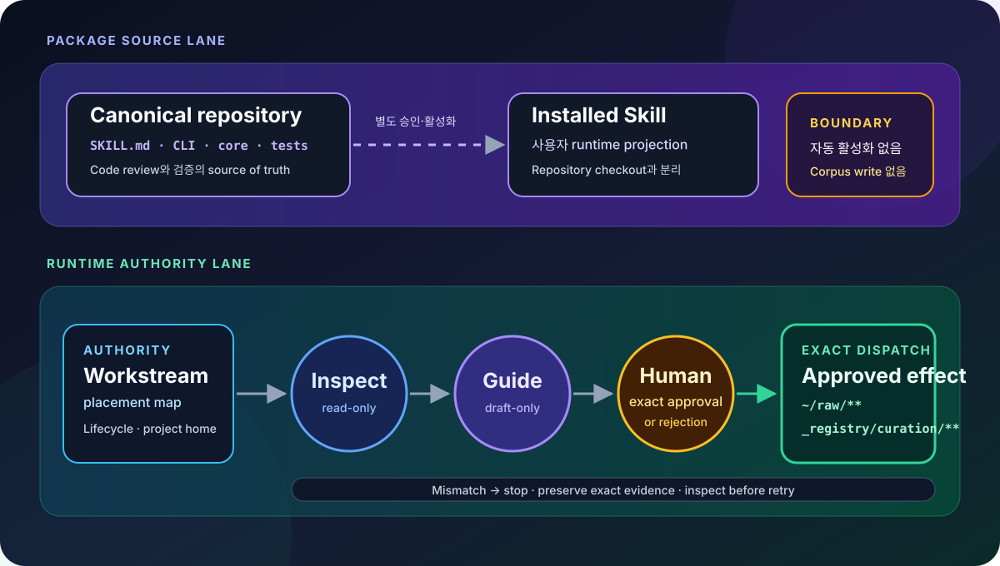
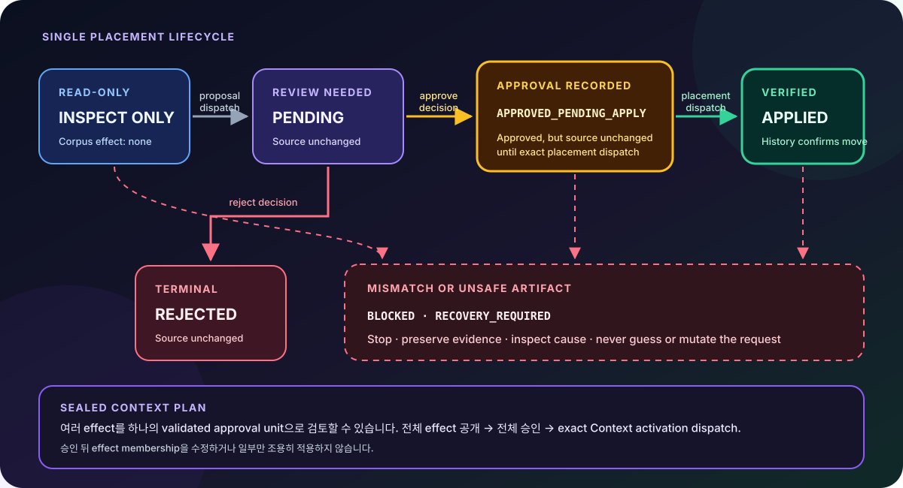

# Mnemosyne

<div align="center">


<br/>


<br/><br/>

<h3>
  먼저 보여주고, 정확히 승인받고,<br/>
  승인된 효과만 그대로 실행하는 <code>~/raw</code> Safe Librarian입니다.
</h3>

<br/>

<p>
  <a href="#작동-구조"></a>
  <a href="#안전-계약"></a>
  <a href="#공개-인터페이스"></a>
  <a href="#읽기-전용으로-시작하기"></a>
</p>

</div>

<br/>

Mnemosyne은 문서, 노트, 메모가 쌓이는 `~/raw`를 Workstream 단위로 점검하고,
이동 제안을 검토 가능한 canonical request로 만든 뒤, 사람이 승인한 정확한 요청만
실행합니다. 저장된 workspace memory의 동기화와 감사도 같은 원칙 아래 제공합니다.
“정리해 줘”처럼 범위가 넓거나 모호한 말은 파일 이동이나 memory 변경 권한으로
해석하지 않습니다.

> 이 저장소는 Mnemosyne 코드, 테스트, Skill 정의의 canonical source입니다.
> `~/raw`의 실제 문서와 memory, 사용자에게 설치된 Skill 복사본은 runtime
> projection이며 이 저장소에 포함되지 않습니다.

<br/>

## 한눈에 보기

<table>
<tr>
<td width="25%" valign="top">

### Inspect first

먼저 하나의 정확한 Workstream을 읽기 전용으로 점검합니다. Paused 또는 completed
Workstream은 내용 대신 count-only frozen coverage만 보여줍니다.

</td>
<td width="25%" valign="top">

### Draft only

`curation guide`와 `memory-sync`의 PLAN은 사람이 검토할 제안만 만듭니다. 제안을
만들었다고 corpus나 memory가 변경되지는 않습니다.

</td>
<td width="25%" valign="top">

### Exact approval

승인은 proposal 또는 sealed Plan의 정확한 내용에만 결합됩니다. 수정이 필요하면 기존
승인을 재해석하지 않고 새 제안을 만듭니다.

</td>
<td width="25%" valign="top">

### Safe stop

경로, 권한, hash, 상태가 달라지면 추측하거나 우회하지 않습니다. `BLOCKED` 또는
`RECOVERY_REQUIRED`로 멈추고 evidence를 보존합니다.

</td>
</tr>
</table>

<br/>

## 작동 구조

저장소의 package source와 사용자의 runtime authority는 분리됩니다. 설치된 Skill을
활성화하는 일도 별도 승인이나 설치 단계가 필요하며, repository checkout 자체가
`~/raw`를 자동으로 변경하지 않습니다.

<p align="center">
  
</p>

Runtime에서는 placement map이 Workstream의 lifecycle과 project home에 대한 authority입니다.
경로 이름이나 비슷한 문자열로 Workstream을 추측하지 않습니다.

<br/>

## 안전 계약

<table>
<thead>
<tr>
<th align="center">허용</th>
<th align="center">차단</th>
<th align="center">중단과 복구</th>
</tr>
</thead>
<tbody>
<tr>
<td width="33%" valign="top">

- 하나의 정확한 Workstream 점검
- bounded read-only view
- TTY에서 reviewable request 작성
- owner-only `0600` artifact 사용
- 승인된 exact request dispatch
- history로 최종 상태 확인

</td>
<td width="33%" valign="top">

- 모호한 정리 요청을 쓰기 권한으로 해석
- 폴더나 유사 이름으로 Workstream 추측
- write request 직접 작성 또는 재해석
- 승인 뒤 source, target, reason 변경
- proposal이나 approval을 완료로 보고
- unsafe artifact를 새 파일로 대체

</td>
<td width="33%" valign="top">

- 변경 또는 불일치가 있으면 즉시 중단
- request와 outcome의 exact bytes 보존
- correction은 새 proposal로 시작
- `BLOCKED` 원인을 먼저 점검
- `RECOVERY_REQUIRED`에서 임의 retry 금지
- placement outcome과 history로 이동 확인

</td>
</tr>
</tbody>
</table>

<br/>

## 승인 상태 흐름

Proposal과 approval은 파일 이동 그 자체가 아닙니다. 단일 placement는 아래 상태를
거치며, 실제 이동은 exact placement request가 성공하고 history가 이를 확인한 뒤에만
`APPLIED`로 보고합니다.

<p align="center">
  
</p>

| 상태 | 의미 |
|---|---|
| `PENDING` | Proposal이 기록되었고 source는 그대로이며 사람의 결정이 필요합니다. |
| `REJECTED` | 사람이 거절했으며 source는 그대로입니다. |
| `APPROVED_PENDING_APPLY` | 승인이 기록되었지만 exact placement가 실행되기 전까지 source는 그대로입니다. |
| `APPLIED` | 승인된 source가 승인된 target으로 이동했고 최종 history가 이를 확인했습니다. |
| `BLOCKED` | 안전 검사가 작업을 중단했습니다. 원인을 확인하기 전에는 계속하지 않습니다. |
| `RECOVERY_REQUIRED` | 요청을 바꾸거나 새로 만들지 않고 evidence를 보존한 채 recovery 상태를 점검합니다. |

하나의 validated sealed Plan에는 여러 effect가 포함될 수 있습니다. 이 경우 전체
effect와 결과를 먼저 보여주고, 사용자의 `전체 승인`을 exact Plan 전체에 결합합니다.
일부를 조용히 빼거나 Plan을 승인 뒤 수정하지 않습니다.

<br/>

## 공개 인터페이스

Mnemosyne은 서로 다른 권한을 가진 세 capability surface를 제공합니다.

| Surface | 역할 | 기본 effect |
|---|---|---|
| Safe Librarian Curation | Workstream을 점검하고 문서 placement를 제안·결정·실행합니다. | 점검과 제안은 없음, 승인된 placement만 이동 |
| `raw-memory-sync` | workspace context를 sealed PLAN과 approval review로 동기화합니다. | 명시적 승인 전 없음 |
| `raw-memory-audit` | 저장된 memory 한 문장의 동기화 정확성과 현재 최신성을 각각 판단합니다. | 항상 없음 |

### Curation CLI

Safe Librarian의 공개 Curation surface는 세 명령으로 제한됩니다.

| 명령 | 역할 | Corpus effect |
|---|---|---|
| `curation inspect` | 고정된 scope, pending, history, audit view를 읽습니다. | 없음 |
| `curation guide` | TTY에서 canonical request 초안을 만들고 의미를 보여줍니다. | 없음 |
| `curation dispatch` | 보존된 exact request bytes를 단일 executor로 전달합니다. | Request 종류와 승인 상태에 따름 |

`dispatch`가 항상 문서를 이동하는 것은 아닙니다. Proposal dispatch는 `PENDING`을,
decision dispatch는 `REJECTED` 또는 `APPROVED_PENDING_APPLY`를 기록합니다. 문서 이동은
승인에 결합된 placement 또는 sealed Context activation request에서만 일어납니다.

최상위 CLI에는 Curation 외에도 `memory-sync`와 `context` surface가 있습니다.

```bash
uv run --no-project scripts/mnemosyne.py --help
uv run --no-project scripts/mnemosyne.py curation --help
```

### Raw Memory Sync

[`raw_memory_sync/SKILL.md`](./raw_memory_sync/SKILL.md)가 approval-gated workspace
context sync의 canonical source입니다. 설치된 Codex·Claude 파일은 생성된 projection일
뿐 source of truth가 아닙니다. Sync는 `mnemosyne-control memory-sync`로 owner-only approval
review를 sealed PLAN에 결합하고, 그 PLAN에서 렌더링한 승인 카드를 보여준 뒤, 승인된
PLAN이 변경되지 않았을 때만 적용합니다.

Raw memory를 직접 쓰거나, PLAN 생성 자체를 승인으로 간주하거나, source code와 CI
결과를 실행하지 않은 runtime의 성공 근거로 바꾸지 않습니다.

### Raw Memory Audit

[`raw_memory_audit/SKILL.md`](./raw_memory_audit/SKILL.md)는 읽기 전용 감사의 canonical
source입니다. 저장된 memory 한 문장을 골라 다음 두 판단을 독립적으로 제공합니다.

1. 원본 session이 실제로 확립한 내용을 정확히 동기화했는가
2. 그 문장이 현재 authoritative source와도 일치하는가

Audit 결과는 현재 대화에만 남으며 report, cache, correction proposal을 저장하지
않습니다. 잘못됐거나 오래된 문장을 발견해도 자동 수정하지 않습니다. 수정은 사용자가
별도로 요청한 `raw-memory-sync`의 기존 승인 절차로 돌아갑니다.

<br/>

## 읽기 전용으로 시작하기

### 요구사항

- Python 3.10 이상
- [`uv`](https://docs.astral.sh/uv/) 권장
- 점검하려는 `~/raw`에 등록된 정확한 Workstream id 또는 alias

### Source checkout

```bash
git clone https://github.com/pureliture/mnemosyne.git
cd mnemosyne
```

> 이 checkout만으로 `~/raw` authority, Workstream registration, installed Skill이
> 초기화되거나 활성화되지는 않습니다. 아래 점검 명령은 Workstream이 이미 등록된
> 준비된 runtime을 대상으로 합니다.

### Workstream 점검

아래 명령은 문서를 이동하지 않습니다.

```bash
uv run --no-project scripts/mnemosyne.py \
  curation inspect scope \
  --workstream <id-or-alias>
```

쓰기 workflow에서는 request를 손으로 만들지 마세요. `curation guide`가 보여준 의미를
검토하고, canonical request와 outcome을 absolute path의 owner-only `0600` regular file로
보존한 뒤 exact bytes를 dispatch해야 합니다. 전체 대화 규칙과 stop condition은
[`SKILL.md`](./SKILL.md)를 기준으로 따릅니다.

### Skill projection 점검

설치 대상과 분리된 임시 home root에 `raw-memory-sync`와 `raw-memory-audit` projection을
만들고 동일한 installer의 check mode로 검증할 수 있습니다.

```bash
uv run --no-project scripts/raw_memory_sync_install.py \
  --home-root /tmp/mnemosyne-home

uv run --no-project scripts/raw_memory_sync_install.py \
  --home-root /tmp/mnemosyne-home --check
```

첫 명령은 지정한 root에 Codex·Claude용 sync projection과 Codex·Claude·Hermes용 audit
projection을 생성합니다. 실제 사용자 home에 설치하는 일은 별도의 명시적 선택입니다.

Local `mnemosyne-control` launcher도 함께 설치하려면 준비된 home root에
`--install-launcher`를 추가합니다. 이 옵션은 `.local/bin/mnemosyne-control`과 owner-only
manifest `.local/share/mnemosyne/installed-entrypoints.json`을 만들며,
`--check --install-launcher`로 둘을 함께 검사할 수 있습니다.

<br/>

## 검증

전체 unittest suite는 다음 명령으로 실행합니다.

```bash
PYTHONDONTWRITEBYTECODE=1 PYTHONPATH=scripts \
  uv run --no-project -m unittest discover -s tests -p 'test_*.py'
```

| 검증 항목 | 현재 상태 |
|---|---|
| Python requirement | `>=3.10` |
| Test framework | standard-library `unittest` |
| Local full suite | 2026-08-02: 1,617 tests 실행, `OK (skipped=1)` |

<br/>

## 저장소와 Runtime 경계

| Surface | Authority와 역할 | 이 저장소에 포함 |
|---|---|---|
| `scripts/mnemosyne.py` | CLI 진입점과 runtime module closure | 예 |
| `scripts/mnemosyne_core/` | policy, inventory, review, durable state, placement safety | 예 |
| `scripts/mnemosyne-control` | local control launcher source | 예 |
| `scripts/raw_memory_sync_install.py` | sync·audit projection과 launcher installer | 예 |
| `tests/` | public contract, safety, recovery, concurrency 검증 | 예 |
| `SKILL.md` | Safe Librarian 대화 규칙과 승인 흐름의 canonical source | 예 |
| `raw_memory_sync/` | approval-gated workspace sync package source | 예 |
| `raw_memory_audit/` | read-only memory audit package source | 예 |
| `references/` | 공개 가능한 layout와 milestone reference | 예 |
| `agents/openai.yaml` | 외부 agent interface 선언 | 예 |
| `~/raw/**` | 사용자의 document corpus와 runtime authority | 아니요 |
| `~/raw/_registry/curation/**` | Curation registry와 local durable runtime state | 아니요 |
| 사용자에게 설치된 Skill·launcher | 활성 runtime projection | 아니요 |

실제 문서 본문, credential, owner-only request/outcome artifact를 issue, screenshot, log,
commit에 포함하지 마세요.

<br/>

## 프로젝트 구조

```text
mnemosyne/
├── agents/
│   └── openai.yaml
├── assets/
│   ├── architecture.svg
│   └── safety-flow.svg
├── raw_memory_audit/
├── raw_memory_sync/
├── references/
├── scripts/
│   ├── mnemosyne-control
│   ├── mnemosyne.py
│   ├── mnemosyne_core/
│   └── raw_memory_sync_install.py
├── tests/
├── pyproject.toml
└── SKILL.md
```

<br/>


